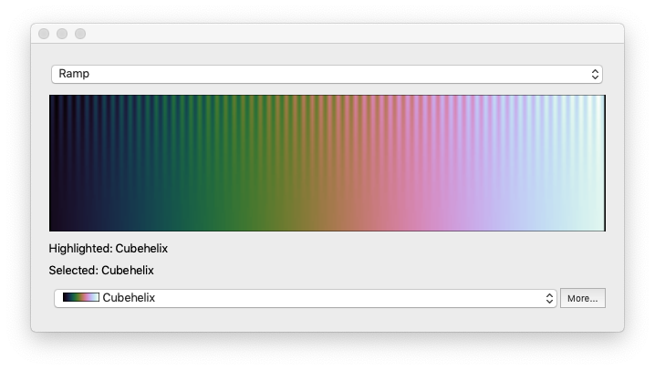

CmLib
=====

CmLib (color map library) is a collection of color maps, which originate from different sources and
that have been converted to a uniform format.

CmLib comes with PyQt widgets to view the collection and select a color map. However, you don't
need Python to use the color maps because the data is stored in comma separated files, which can be
read in any programming language.

I started this project because I needed good color maps for
[Argos](https://github.com/titusjan/argos) and couldn't choose between the various catalogs. The
Python widgets were developed to be able to  select color maps in Argos.

### The Color Maps 

CmLib currently includes color maps from the following four catalogs:

* [CET](https://peterkovesi.com/projects/colourmaps/)
* [ColorBrewer2](https://colorbrewer2.org/)
* [MatPlotLib](https://matplotlib.org/tutorials/colors/colormaps.html)
* [Scientific Colour Maps](http://www.fabiocrameri.ch/colourmaps.php)

Every catalog has a `_catalog.json` file with metadata about that catalog. Every color map has a
CSV file with floating point RGB values (between 0 and 1), and a JSON file with metadata about that
color map.

### License

CmLib itself is released under the BSD license. Note that the color map catalogs itself may have
different licenses. See the `_catalog.json` file for the license of a particular catalog. 

### Installing CmLib

If you only want to use the color map data in your project, just clone or download this repository
from Github and copy the `cmlib/cmlib/data` directory. Please leave the `readme.txt` intact.

If you want to use the selection drop downbox and the catalog viewer you must have
[Python](https://www.python.org/) installed. They require
[PyQt5](https://www.riverbankcomputing.com/software/pyqt/intro) and [Numpy](http://www.numpy.org).
You can install these with pip, provided you have at least Python 3.5.

    %> pip install PyQt5
    %> pip install numpy
    %> pip install cmlib

After that you should be able to start the demo with:

    %> cmlib_demo

### Running the Demo

After starting the `cmlib_demo` program the following window will appear:

The drop down box at the top allows you to select one of seven test images. You can read more about
them in [this blog post](http://inversed.ru/Blog_2.htm#Testing) by Peter Karpov, which, in turn,
was inspired by the [Good Colour Maps: How to Design Them](https://arxiv.org/abs/1509.03700)
article by Peter Kovesi.

The drop down box at the bottom gives a selection of a few color maps. If you select one, the test
image will be colorized with the selected map. It only contains a small selection of user-favorite
color maps. To access the complete database click on the `More...`button. This will open the
_Viewer_ dialog window that is shown in the screen shot at the top of this page.

The Viewer contains a table that lists all the color maps in the database. The test image will be
colorized immediately when you select a color map in the table. If you double click a color map (or
click the `Ok` button) the Viewer will close the viewer window. Clicking `Cancel` will also close
the Viewer and will reset the test image to the color map that was selected at the moment the
viewer was opened.

By checking the check box in the left most column of the table (★), you can add color maps to your
favorites. These are added to the drop down box in the demo window. Note that the favorites are not
remembered by the demo program. Programs that use CmLib are responsible for storing the favirotes
between sessions.

You can sort the table by clicking one of the column headers in the table. By right-clicking on the
table header you can add or remove table columns.

Located on the left side of the Viewer are drop-down and checkboxes that allow you to show/hide
color maps in the table. These filters let you only view a subset of the color maps and so make it
easier to browse the collection and make a choice.

### Choosing a good Color Map.

https://everydayanalytics.ca/2017/03/when-to-use-sequential-and-diverging-palettes.html

https://medium.com/nightingale/how-to-choose-the-colors-for-your-data-visualizations-50b2557fa335

https://blog.datawrapper.de/which-color-scale-to-use-in-data-vis/

https://www.nature.com/articles/s41467-020-19160-7.pdf

